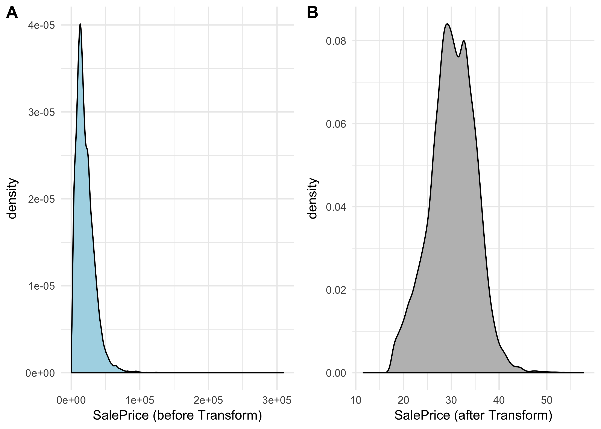
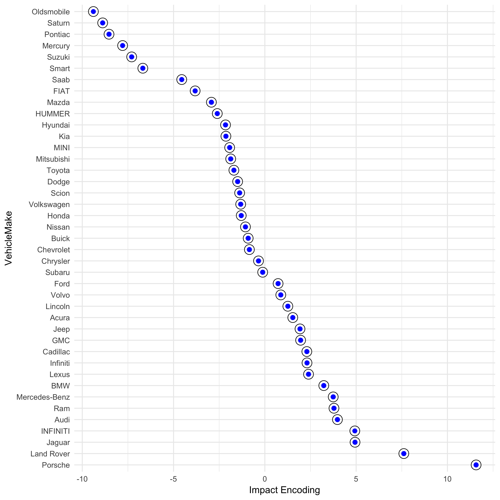

Introduction
============

Imagine working with a dataset containing all the zip codes in the United States. That is a datset containing nearly 40,000 unique categories. How would you deal with that kind of data if you planned to do predictive modelling? One hot encoding doesn't get you anywhere useful, since that would add 40,000 sparse variables to your dataset. Throwing the data out could be leaving valuable information on the table, so that doesn't seem right either.

In this post, I'm going to examine how to deal with categorical variables with high cardinality using a stratey called *impact encoding*. To illustrate this example, I use a data set containing used car sales. The probelm is especially well suited because there are several categorical features with many levels. Let's get started.

------------------------------------------------------------------------

Data Examination & Visualization
================================

Here is a sample of the data I will be analyzing. As can be seen, there are several columns (e.g. `VehicleMake`,`VehicleModel`, and `VehicleTrim` ) which are categorical. Most of these columns have 50 to 1000+ levels in no particular order. If we were to naively dummy encode these variables, we would be left with a very high dimensional problem.

I've already went ahead and cleaned the data, transforming the dates to days before the most recent date. There are some missing entries, and so I will just treat the missingness as another level.

    ## # A tibble: 6 x 17
    ##   VehicleYear VehicleMake VehicleModel VehicleTrim VehicleMarketClassId
    ##         <dbl>       <ord>       <fctr>      <fctr>               <fctr>
    ## 1          10       Acura           TL        Base                   44
    ## 2           7       Dodge      Avenger         SXT                   44
    ## 3           8       Dodge      Caliber         SXT                   43
    ## 4           9       Dodge      Caliber         SXT                   43
    ## 5           9       Dodge      Avenger         SXT                   44
    ## 6           5    Chrysler          200          LX                   44
    ## # ... with 12 more variables: ContractDate <dbl>, DeliveryOdometer <int>,
    ## #   TotalClaims <fctr>, City <fctr>, Province <fctr>, FSA <fctr>,
    ## #   company_id <fctr>, dealer_type <fctr>,
    ## #   HasPoliceReportedAccident <int>, AccidentDate <dbl>,
    ## #   AccidentDetail <fctr>, SalePrice_bc <dbl>

I've also gone agead and performed a Box-Cox transform on `VehicleSalePrice` (shown below) in order to get the variable closer to a normal distribution. 

Now is where we would do some exploratory data analysis. I'm going to leave that out for now and focus on encoding the factors with impact encoding.

Impact Encoding.
================

Let **y** denote our response variable, and let **x** be a cateforical feature. The impact coding of **x** is

Ic(𝐱) = E\[**y**|**x**\] − E\[**y**\] .

Applied to data manipulation, we just group by the factors and take the mean of our response variable (in this example it is `SalePrice_bc`), then subtract the mean of the entire response. Not only does this present a numerical encoding, it presents an ordered encoding.

I could loop through the factor columns, but there is an easier way to encode the categorical variables using a new library called `vtreat`. The library has a very nice [companion paper on arXiv](https://arxiv.org/abs/1611.09477). In this paper are recomendations for encoding variables and examples. I highly recommend you read the paper before using the library. For our data, the encoding is as simple as

``` r
#Prepare a treatment plan for the dataframe
treatment <- vtreat::designTreatmentsN(dframe = car_data,
                                       varlist = colnames(car_data),
                                       outcomename = 'SalePrice_bc',
                                       verbose = F)

scoreFrame = treatment$scoreFrame

#Which vars do we want to keep
vars <- scoreFrame$varName[(scoreFrame$code %in% c("catN", "clean"))] #read paper to see what CatN and Clean mean

#Apply the treatment plan
treated_data = vtreat::prepare(car_data,
                               treatmentplan = treatment,
                               varRestriction = vars)

treated_data %>% head
```

    ##   VehicleYear_clean VehicleMake_catN VehicleModel_catN VehicleTrim_catN
    ## 1                10        1.5295975        -0.3261005      -0.01005822
    ## 2                 7       -1.4900646        -6.1615392      -1.95291614
    ## 3                 8       -1.4900646        -8.1948582      -1.95291614
    ## 4                 9       -1.4900646        -8.1948582      -1.95291614
    ## 5                 9       -1.4900646        -6.1615392      -1.95291614
    ## 6                 5       -0.3470274        -1.0783845      -2.10830337
    ##   VehicleMarketClassId_catN ContractDate_clean DeliveryOdometer_clean
    ## 1                 -1.603560                  9                  53000
    ## 2                 -1.603560                 11                 126999
    ## 3                 -2.425183                  7                  88281
    ## 4                 -2.425183                 18                 161000
    ## 5                 -1.603560                 20                 102378
    ## 6                 -1.603560                 17                  72519
    ##   TotalClaims_catN City_catN Province_catN   FSA_catN company_id_catN
    ## 1        0.2790865  1.137412     0.6143421  0.2795608       0.4079938
    ## 2        0.2790865 -1.422227    -0.7117596 -1.6636507      -1.2642958
    ## 3        0.2790865 -1.422227    -0.7117596 -1.0112972      -3.5890595
    ## 4        0.2790865 -1.422227    -0.7117596 -1.0112972      -0.2634058
    ## 5       -1.0888297  1.002487     1.4399098  0.4747097       0.7841858
    ## 6       -1.0888297  1.002487     1.4399098  0.7453351       1.0345593
    ##   dealer_type_catN HasPoliceReportedAccident_clean AccidentDate_clean
    ## 1       -0.5146604                               0                 -2
    ## 2       -0.5146604                               0                 -2
    ## 3       -1.1791155                               0                 -2
    ## 4       -1.4179906                               0                 -2
    ## 5       -1.1791155                               0                 -2
    ## 6        0.4956054                               0                 -2
    ##   AccidentDetail_catN SalePrice_bc
    ## 1           0.1968489     27.53527
    ## 2           0.1968489     22.09732
    ## 3           0.1968489     21.36304
    ## 4           0.1968489     19.89512
    ## 5           0.1968489     20.36517
    ## 6           0.1968489     22.70686

Now all your categorical variables have an ordered numeric encoding.

To prove that the impact encoding works as promises, I have plotted the results from `vtreat` in blue, and the manual impact encodings in black for the variable `VehicleMake`. As you can see, the manual encoding and `vtreat`'s encoding are exactly the same.



Conclusion
==========

Some datasets contain categorical levels which can not be one hot encoded because they contain so many levels. As good data scientists, we want to retain possible useful information but do not want to increase the size of our feature set. Impact encoding is a useful way to encode categorical features of high dimension. The library `vtreat` is a new library that was created to implement impact encoding and removes the difficulty of looping through several columns.
